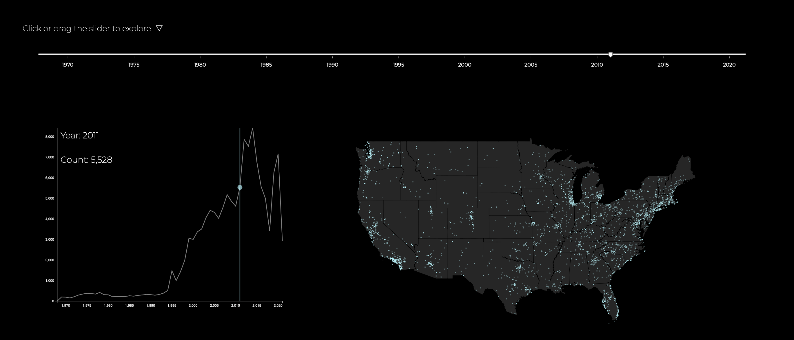

# 🛸UFOs in the USA: Mapping Decades of sightings with Location, Trends, Shapes, and Witness Testimonies

Created by: Yujia Huo

Data Sourse: https://nuforc.org 

Language Used: Javascript, Python, D3.js

View the Project Directly: [https://yujia-huo.github.io/ufoViz/](https://yujia-huo.github.io/ufoViz/)

Read More: （link to write up)

Unidentified Flying Objects (UFOs) have been a topic of fascination and controversy for decades. With the advancements in technology, more and more sightings are being reported and documented across the United States. The following visualization will be based on dataset from National UFO Reporting Center to explore the UFO sighting to presenting different perspectives.

## Visualization: Location and Trending

The first visualization shows the location and trend of the UFO sighting report. A slider will be used for interaction purposes to allow the user to explore the distribution.

Slider: https://github.com/johnwalley/d3-simple-slider.

The json file to geojson: https://github.com/topojson/topojson.

## Visualization: Shapes

We definitely interested in to see what people saw, and find some insight from that. The lollipop chart shows the count of each shape.

Reference:https://d3-graph-gallery.com/lollipop.html.

## Visualization: Witness Testimonies

The data collected witness testimonies of the reported sightings, which provide a firsthand account of the events. These testimonies add credibility to the sightings and help in understanding the nature of the sightings. The word cloud shows the top 80 most common words that witness use in their testimonies.

Support word cloud generation: https://github.com/jasondavies/d3-cloud

Count words Method: [https://colab.research.google.com/drive/1db3LtjEvUGXzlqxflRK4zveeTSwzT8FG?usp=sharing](https://colab.research.google.com/drive/1db3LtjEvUGXzlqxflRK4zveeTSwzT8FG?usp=sharing)

## Governments report

Finally, refer to the new report, shows the explanation from the government.